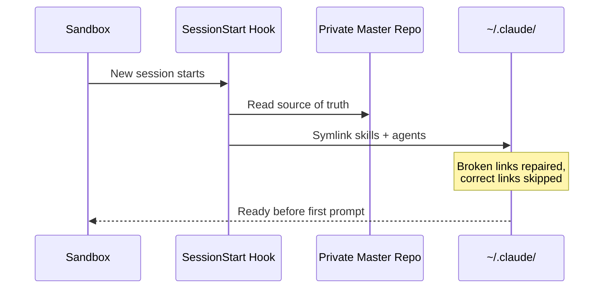

# A Self-Healing, Three-Tier Orchestration System for Claude Code

*A private "master" repo, a SessionStart hook, and an adversarial-verification primitive turn a personal Claude Code setup into an architecture that rebuilds itself from source every session and audits its own judgment calls.*

## The problem

Claude Code's skill and agent system lives in `~/.claude/` — a directory any sandbox reset, cleanup script, or fresh container can wipe without warning. The naive fix is to hand-install skills into that directory and hope. That breaks the moment the environment churns, which for anyone running Claude Code across dozens of projects concurrently is often. The deeper problem isn't just durability, though — it's discipline. A multi-agent setup accumulates ad-hoc red-teaming, decision logs nobody trusts because anyone can silently edit them, and no way to tell, months later, *why* a given call was made.

## The constraint

Built and maintained by one person, across dozens of concurrently active projects, with no dedicated infra team and no ops habit to lean on. Durability had to come from the architecture itself, not from remembering to reinstall something correctly every time an environment reset.

## The approach

Three tiers, split by whether the layer *executes*, *loads*, or *is invoked*:

```
TIER 1 — auto-executing hooks (no invocation, fire on events)
  SessionStart → symlink sync (self-heal ~/.claude/skills|agents from master)
  PreToolUse   → trace capture (every tool call, redacted, ms-stamped)
  PostToolUse  → failure-signal logging (severity-tagged, TTL-expiring)
  (also) token-ledger ingestion

TIER 2 — auto-loading context (no execution, shapes behavior)
  global + project CLAUDE.md router · memory files · skill description index

TIER 3 — invoked judgment (explicit or model-routed)
  frame → forge → kickoff → observation → (trace → rca on failure)
  gated throughout by `challenge` (adversarial refutation)
```

The dividing line is mechanical: Tier 1 fires on deterministic events and needs no judgment; Tier 2 is always in context but executes nothing; Tier 3 is where actual reasoning happens. Anything meant to be automatic has to attach to a Tier-1 event or a Tier-2 load — judgment itself can't be hooked, which is why the delivery lifecycle stays a set of invoked skills rather than a script.

The lifecycle: **frame** widens a fuzzy problem before anything narrows; **forge** hardens it into a rigorous prompt via interrogation; **kickoff** lays the build out as milestones; **observation** logs material decisions as they happen; **trace/rca** reconstruct what went wrong when something breaks, verify-first rather than theorize-first. Every stage that produces something a downstream stage will rely on — a forged prompt, an RCA's proposed fix, a finished spec — passes through **challenge**: independent, blind agents whose only mandate is to *refute* it, returning a fixed verdict (ship / revise / kill) plus ranked, fixable weaknesses.



What makes this novel:

**1. Architecture-as-code durability.** Nothing is hand-installed. A `SessionStart` hook (`sync-global-skills.sh`) walks a single private master repo and idempotently symlinks every skill and agent into `~/.claude/`, repairing anything broken and skipping anything already correct. If a sandbox prunes the whole directory, the next session heals it before the first prompt — the source of truth never lived in the disposable location to begin with.

**2. `challenge` as a reusable primitive, not a one-off step.** Forge, RCA, kickoff, research, and the portfolio-review skill all call the same adversarial-refutation gate rather than each improvising red-teaming inline. It runs both post-hoc (verdict on a finished artifact) and in-flight (cross-examining a decision while it's still cheap to change).

**3. Hash-chained decision logging.** Material decisions append to a JSONL log where each entry embeds a SHA-256 hash of the previous entry. Editing or deleting a past line breaks the chain at the very next append — tamper-evidence without a database, verifiable with a plain read.

**4. Real dogfooding, not a demo.** The system runs its own failure-signal loop against itself: one drain pass processed 332 logged failure signals across 22 real project repos (285 resolved, the rest explicitly deferred or left open, none silently dropped). The underlying test suite sits in the 200s and has been run clean at multiple checkpoints across the build.

## Outcome

A personal Claude Code environment that survives environment churn by construction, replaces ad-hoc verification with one adversarial primitive every discipline shares, and keeps an append-only, tamper-evident record of why decisions were made — checked against real usage across a working multi-project portfolio, not a single showcase repo.

## What I'd do differently

The failure-signal loop still needs a person to run the drain pass. I'd rather it resolved signals on its own as they happened than let them stack up for a periodic sweep.
