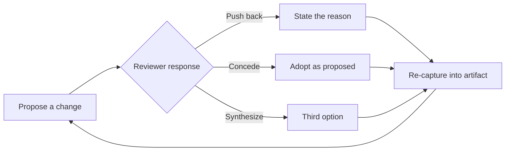

# Converging AI-Assisted Design Without Sycophancy

*A reusable method for hardening architecture decisions in multi-turn AI design sessions — developed and field-tested on a multi-agent product build.*

## The problem

When you design architecture in conversation with an LLM, the model's default behavior works against you. It agrees. It elaborates on your last idea instead of stress-testing it. Ask "does this look right?" three turns in a row and you'll get three affirmations — not because the design is right, but because agreement is the path of least resistance for the model.

That's dangerous in architecture work specifically, because the errors that matter are quiet ones: a mechanism (an implementation detail, likely to change) gets drawn as if it were structure (a permanent fact of the domain). A six-step pipeline gets frozen into the data model. An open question gets treated as decided just because nobody pushed back on it in the moment. None of these show up as bugs — they show up eighteen months later as "why is this so hard to change."

## The constraint

This had to be developed and used live, during real design sessions under real time pressure — not as a separate review process someone would have to remember to run afterward. Anything that couldn't fit inline into an ordinary working conversation wasn't going to survive contact with actual use.

## The approach

Two disciplines, run together, on a live artifact rather than in abstract discussion.

**1. Classify every element.** Each part of the design gets sorted into one of three buckets:
- **Invariant** — true regardless of how it's built; changing it changes the problem itself.
- **Policy** — a choice the team made, which a future decision could reasonably revisit.
- **Mechanism** — how it's implemented today; expected to change.

The single most common error caught by this pass is *mechanism drawn as structure* — treating a replaceable implementation choice as if it were an invariant. Example: a team pipelines five processing steps to extract structured data from a document. It's tempting to bake "five steps, in this order" into the data model. But the steps are a mechanism (today's tooling); what's actually invariant is only "raw input maps to zero-or-more structured facts, each traceable to its source." Freeze the mechanism and every future re-architecture has to fight the schema. Freeze only the invariant, and the pipeline can be rebuilt freely.

**2. Propose → push back / concede / synthesize → re-capture.** Every turn mutates a concrete artifact — a diagram, a doc — never just talk. One side proposes a change; the other must do one of three things, not just nod: push back (with a reason), concede outright, or synthesize a third option that resolves what both were reaching for. Whichever happens, the decision is written back into the artifact immediately, so the shared object of the conversation stays current.

Progress across a session shows up as the *questions* maturing: "what's missing?" (completeness) gives way to "what's misclassified?" (invariant vs. policy vs. mechanism), which gives way to "what's misleading?" (will someone who wasn't in this conversation misread it?). Reaching "misleading" is the signal the design has stabilized — not a fixed number of rounds, not a checklist score.

The key insight: **agreement is a drift signal, not a consensus signal.** If a stretch of the session goes by with nothing but agreement, the default assumption should be that *the reviewer* has drifted — stopped applying real scrutiny — not that the proposer has become correct. Sustained frictionless agreement is far more often a sign that critical evaluation has quietly lapsed than a sign the design reached truth. The discipline is to treat a smooth patch as a prompt to look *harder*, not as permission to relax.

## Outcome

Architecture mistakes are expensive precisely because they're invisible at design time — they surface as painful, cross-cutting rework much later. A method that (1) forces every element through an explicit invariant/policy/mechanism cut and (2) refuses to let comfortable agreement pass as validation gives AI-assisted design review a concrete defense against its most natural failure mode: politely agreeing its way to a bad architecture.

## What I'd do differently

Right now it only works if someone actually notices the smooth stretch in the moment — nothing catches it automatically. A simple heuristic (flag N turns in a row with no pushback) would move that catch out of memory and into the tooling, where it can't be skipped under deadline pressure.
