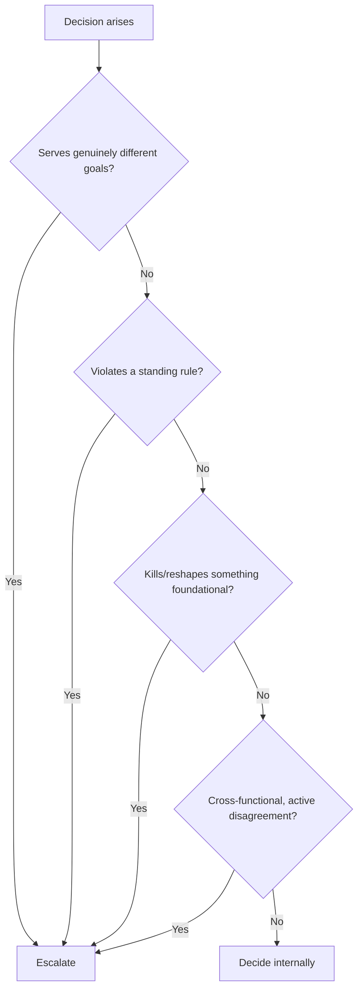

# theorg: Governance-as-Code for Multi-Agent Systems

*An organizational layer — not another agent framework — that keeps a fleet of AI agents coherent as their number grows, by giving them a real org chart instead of a bigger prompt.*

## The problem

Multi-agent setups fall apart in a predictable way. Below two or three agents, informal coordination works — one agent just asks another. Past that, coordination collapses on its own:

- Two agents both believe they own the same task, and both act on it.
- A decision made in one session gets silently re-derived in the next, because nothing recorded *why* the first one was made.
- A directive gets issued once, then quietly ignored downstream, because no agent was accountable for enforcing it.
- Escalations either never happen (agents grind on past their mandate) or happen constantly (every call gets kicked upstairs, and the human becomes the bottleneck again).

The instinctive fixes make it worse. A single "god-agent" supervising everyone becomes a context-window and judgment bottleneck of its own. Ad hoc coordination has no memory, no ownership boundaries, and no way to tell a genuine trade-off from routine status noise. The chaos is the bottleneck, not the agents' capability.

## The constraint

Six roles is a deliberately small org — sized for a single operator's fleet of agents, not a large team. The contract model hasn't been tested at a scale where multiple role contracts might start colliding with each other, and it isn't claimed to.

## The approach

theorg treats this as an organizational-design problem, not a prompting problem. Six C-suite-style roles — CEO, CFO, COO, Chief of Staff, GM, and a "throughput" role — each get a written contract: what they **own**, what they can decide **alone**, and when they must **escalate**.

Two mechanisms carry most of the weight:

**A hard escalation filter.** Before bubbling a decision up, an agent runs a four-question gate, stopping at the first "yes": Do the options serve genuinely different goals? Does this violate a standing rule? Would it kill or reshape something foundational? Is this cross-functional with active disagreement between peers? All four "no" → decide internally. This alone kills most unnecessary escalation traffic — status updates never reach the top.

**Defense-pairing.** Instead of one agent unilaterally setting a limit, opposing roles argue opposite sides of the same resource question. The CFO-equivalent role defends a resource *ceiling* (don't overspend); the throughput-equivalent role attacks the *floor* (don't leave capacity idle). Neither wins by default — the tension between them is the control. A second pair works the same way over work quality: one role holds the line on what's already built, the other pushes against it with change proposals. The disagreement itself is the useful signal, not a bug to resolve away.

Every agent inherits a shared contract too: decisions get logged with rationale, "done" requires evidence, artifacts are honestly tagged production-tested / designed-but-unverified / roadmap-only. It runs in **org mode** (all six roles coordinating on a live project) or **standalone mode** (one role alone, contract still enforced) — the discipline scales down, not just up.

Why organizational patterns, not more prompting: the instinct when agents conflict is a longer, more careful system prompt. That scales badly — every new agent needs the others' prompts updated to know about it. Real organizations solved this for humans already: separation of duties, paired accountability instead of a single point of authority, and a strict test for what escalates versus what a role just decides. Porting that structure, not just its vocabulary, gives the fleet a scaling mechanism that doesn't run through a human hand-editing every prompt.

## Outcome

A working governance layer with six defined roles, a mechanical escalation gate, and two live defense-pairs, tagged honestly by maturity rather than ambition — built to keep growing without a human re-arbitrating every new agent conflict by hand.

## What I'd do differently

The four-question filter lives in a document, not in code — an agent could misapply it and nothing would catch that. Before adding a seventh role, I want that gate itself under test, not just under instruction.
